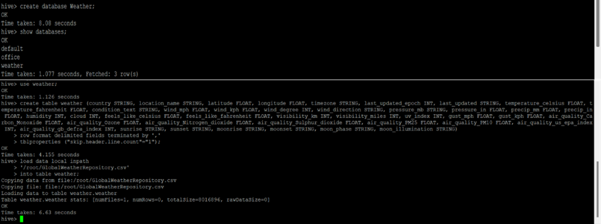

# Big Data Weather and Air Quality Analytics with Hadoop Ecosystem and Power BI

## 📌 Project Overview
This project demonstrates the deployment and integration of Hadoop and its ecosystem tools (Apache Hive, HCatalog, and Apache Pig) for large-scale weather and air quality data analysis.  
The dataset, sourced from the **World Weather Repository (Kaggle)**, includes attributes such as temperature, humidity, visibility, UV index, and air quality indicators (CO, Ozone, NO2, PM2.5, PM10).  

The goal of the project is to build a **scalable big data pipeline** for processing, cleaning, and analysing weather datasets and to visualise insights using **Power BI** for decision-making in climate-sensitive sectors.

---

## 🎯 Objectives
- **Understand Weather Patterns and Trends** – uncover seasonal and geographical behaviours.  
- **Monitor and Assess Air Quality** – evaluate the impact of pollutants on health and environment.  
- **Visualise Climate Insights** – create dashboards in Power BI to communicate findings clearly.  

---

## 🏗️ Architecture & Tools
- **HDFS (Hadoop Distributed File System)** – scalable data storage  
- **Apache Hive** – SQL-like querying for structured data  
- **Apache HCatalog** – metadata management  
- **Apache Pig** – data transformation and cleaning  
- **Power BI** – interactive data visualisation  

---

## ⚙️ Project Workflow
1. **Deployment of Hadoop Servers**  
   Configured Hadoop on Oracle VirtualBox with HDFS, YARN, and supporting tools.  

2. **Data Integration & Cleaning**  
   - Imported Kaggle datasets into Hive via HCatalog  
   - Removed duplicates, null values, and outliers  
   - Standardised timestamps and categorised weather conditions  

3. **Descriptive Analytics**  
   - Explored temperature, humidity, UV index, and pollutant levels  
   - Built analysis-ready tables (`weather_data_analysis`, `air_quality_data_analysis`)  

4. **Data Visualisation (Power BI)**  
   - Weather trends across months  
   - Air quality impact across regions and conditions  
   - Visibility and UV index analysis  

---

### Hive Query Examples

### Pig Data Cleaning

### Power BI Dashboards

---